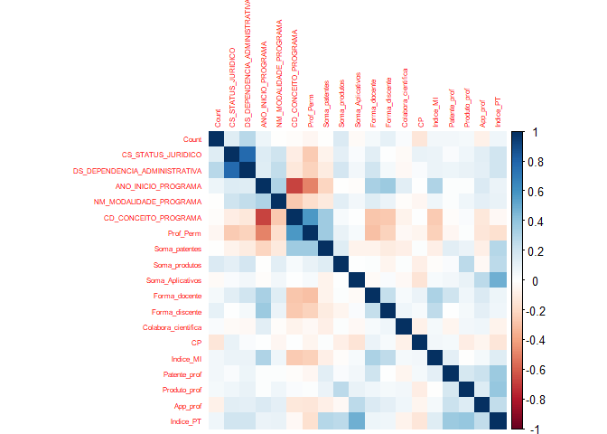
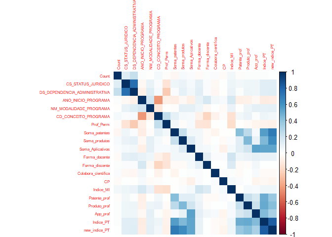
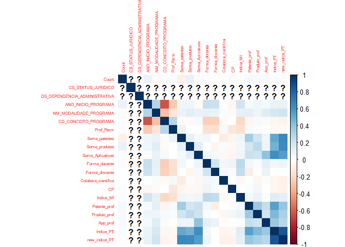
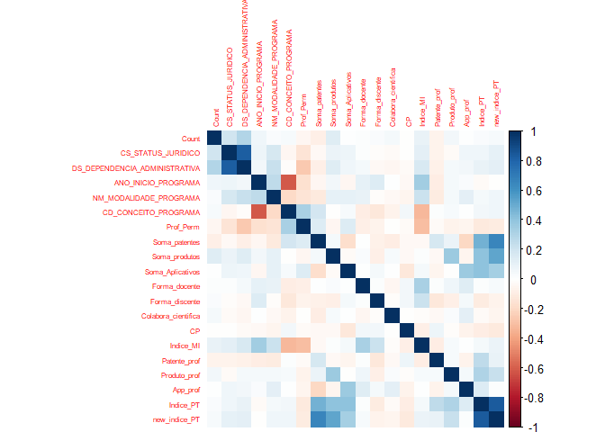

# Contexto do Estudo

A análise  

**Objetivo do estudo:** O objetivo do estudo é aplicar técnicas de machine learning para estabelecer o contexto dos programas de pós-graduação que possuem correlação positiva entre Perfil multi/interdisciplinar e produção de tecnologias.

**Pergunta de pesquisa:** Quais as características do contexto contexto dos programas de pós-graduação que possuem correlação positiva entre Perfil multi/interdisciplinar e produção de tecnologias?

**Recorte de análise:** Dados dos programas de pós-graduação entre os anos 2013 até 2016.

# Método e materiais


.....

## Fonte de Dados

1. Data from Lattes Platform - Extract by Instituto Stela
2. Data from Sucupira Platform


```r
library(dplyr)
library(plotly)
library(ggplot2)
library(tidyr)
library(magrittr)
library(plotrix)
library(rgl)
library(car)
library(lubridate)
library(ggplot2)
library(GGally)
library(corrplot)
library(corrgram)
library(ppcor)
library(plyr)
library(ggpubr)
library(fastcluster)
library(cluster)

.Unianalysis = function (x) {
    y <- as.data.frame(table(x))
    y <- arrange(y, desc(y$Freq))
         return(y)
}
```


```r
#Import Data
library(readr)
IMI <- read_delim("IMI.csv", ";", escape_double = FALSE, 
    trim_ws = TRUE)

IPT <- read_delim("IPT.csv", ";", escape_double = FALSE, 
    trim_ws = TRUE)

Estados <- read_delim("Estados.csv", ";", escape_double = FALSE, trim_ws = TRUE)


IMI_IPT <- merge(IMI, IPT, by = "CD_PROGRAMA_IES", all.x = TRUE)

write.csv2(IMI_IPT, file = "IMI_IPT.csv", fileEncoding = "UTF-8")
```

# Tidyng

## DS_DEPENDENCIA_ADMINISTRATIVA

PUBLICA = 0
PRIVADA = 1

## NM_MODALIDADE_PROGRAMA

ACADEMICO = 0
PROFISSIONAL = 1

## CS_STATUS_JURIDICO

MUNICIPAL = 1
ESTADUAL = 2
FEDERAL = 3
PARTICULAR = 4

## Rename Variables


```r
IMI_IPT_Tidy <- read_delim("IMI_IPT_Tidy.csv", 
    ";", escape_double = FALSE, col_types = cols(ANO_INICIO_PROGRAMA = col_number(), 
        App_prof = col_number(), CD_CONCEITO_PROGRAMA = col_number(), 
        CP = col_number(), CS_STATUS_JURIDICO = col_number(), 
        Colabora_cientifica = col_number(), 
        Count = col_number(), DS_DEPENDENCIA_ADMINISTRATIVA = col_number(), 
        Forma_discente = col_number(), Forma_docente = col_number(), 
        Indice_MI = col_number(), Indice_PT = col_number(), 
        NM_MODALIDADE_PROGRAMA = col_number(), 
        Patente_prof = col_number(), Produto_prof = col_number(), 
        Prof_Perm = col_number(), Soma_Aplicativos = col_number(), 
        Soma_patentes = col_number(), Soma_produtos = col_number()), 
    trim_ws = TRUE)
```

```
## Warning: Missing column names filled in: 'X1' [1]
```

```r
IMI_IPT_T1<- IMI_IPT_Tidy %>%
              mutate(new_indice_PT = (Soma_Aplicativos+Soma_produtos+Soma_patentes)/Prof_Perm)

M_State <- merge(IMI_IPT_T1, Estados, by = "CD_PROGRAMA_IES", all.x = TRUE)

write.csv2(IMI_IPT_T1, file = "IMI_IPT_T1.csv", fileEncoding = "UTF-8")

write.csv2(M_State, file = "M_State.csv", fileEncoding = "UTF-8")

cor(IMI_IPT_T1$Indice_MI, IMI_IPT_T1$new_indice_PT, method = "pearson")
```

```
## [1] 0.03840356
```

# With 3 full metrics of Technologies Production
    

```r
IMI_IPT_Full_IPT <- IMI_IPT_T1 %>%
              filter(Soma_Aplicativos > 0, Soma_patentes >0, Soma_patentes > 0)
              

dim(IMI_IPT_Full_IPT)
```

```
## [1] 338  22
```

```r
summary(IMI_IPT_Full_IPT)
```

```
##        X1         CD_PROGRAMA_IES        Count        CS_STATUS_JURIDICO
##  Min.   :  10.0   Length:338         Min.   :  10.0   Min.   :1.000     
##  1st Qu.: 883.2   Class :character   1st Qu.: 883.2   1st Qu.:3.000     
##  Median :1434.5   Mode  :character   Median :1434.5   Median :3.000     
##  Mean   :1459.2                      Mean   :1459.2   Mean   :2.991     
##  3rd Qu.:2114.0                      3rd Qu.:2114.0   3rd Qu.:3.000     
##  Max.   :2838.0                      Max.   :2838.0   Max.   :4.000     
##  DS_DEPENDENCIA_ADMINISTRATIVA ANO_INICIO_PROGRAMA NM_MODALIDADE_PROGRAMA
##  Min.   :0.0000                Min.   :1960        Min.   :0.0000        
##  1st Qu.:0.0000                1st Qu.:1990        1st Qu.:0.0000        
##  Median :0.0000                Median :2003        Median :0.0000        
##  Mean   :0.1893                Mean   :1998        Mean   :0.1479        
##  3rd Qu.:0.0000                3rd Qu.:2010        3rd Qu.:0.0000        
##  Max.   :1.0000                Max.   :2016        Max.   :1.0000        
##  CD_CONCEITO_PROGRAMA   Prof_Perm     Soma_patentes    Soma_produtos   
##  Min.   :3.000        Min.   : 8.00   Min.   : 1.000   Min.   : 0.000  
##  1st Qu.:3.000        1st Qu.:13.00   1st Qu.: 1.000   1st Qu.: 0.000  
##  Median :4.000        Median :16.00   Median : 3.000   Median : 0.000  
##  Mean   :4.175        Mean   :19.93   Mean   : 6.234   Mean   : 1.799  
##  3rd Qu.:5.000        3rd Qu.:23.00   3rd Qu.: 7.000   3rd Qu.: 2.000  
##  Max.   :7.000        Max.   :92.00   Max.   :91.000   Max.   :52.000  
##  Soma_Aplicativos Forma_docente       Forma_discente      Colabora_cientifica
##  Min.   : 1.000   Min.   :        2   Min.   :        1   Min.   :        1  
##  1st Qu.: 1.000   1st Qu.:274183006   1st Qu.:133720930   1st Qu.:430488258  
##  Median : 2.000   Median :449849170   Median :322126437   Median :509435752  
##  Mean   : 4.361   Mean   :430858176   Mean   :340755780   Mean   :453461931  
##  3rd Qu.: 5.000   3rd Qu.:611111111   3rd Qu.:555220884   3rd Qu.:560495754  
##  Max.   :33.000   Max.   :952380952   Max.   :868421053   Max.   :958333333  
##        CP              Indice_MI          Patente_prof      
##  Min.   :        1   Min.   :   524877   Min.   :        1  
##  1st Qu.:359416041   1st Qu.:375793354   1st Qu.: 32526882  
##  Median :432500000   Median :467942846   Median : 83333333  
##  Mean   :373090280   Mean   :440400754   Mean   :172446760  
##  3rd Qu.:486395474   3rd Qu.:559820849   3rd Qu.:262585812  
##  Max.   :666666667   Max.   :808461211   Max.   :933333333  
##   Produto_prof          App_prof           Indice_PT         new_indice_PT    
##  Min.   :        0   Min.   :        1   Min.   :        1   Min.   :0.05556  
##  1st Qu.:        0   1st Qu.: 13313008   1st Qu.: 57045945   1st Qu.:0.25232  
##  Median :        0   Median : 71428571   Median :128205128   Median :0.47214  
##  Mean   : 47760613   Mean   :136148027   Mean   :172084562   Mean   :0.69475  
##  3rd Qu.: 68390804   3rd Qu.:166666667   3rd Qu.:252258356   3rd Qu.:0.88052  
##  Max.   :769230769   Max.   :956521739   Max.   :743589744   Max.   :5.07143
```

```r
corrplot(cor(IMI_IPT_Full_IPT[,3:21]), method = "color", tl.cex = 0.5)
```

<!-- -->

# Start program after 2002 - Original metrics


```r
IMI_IPT_M2002 <- IMI_IPT_T1 %>%
              filter(ANO_INICIO_PROGRAMA > 2002)
             
dim(IMI_IPT_M2002)
```

```
## [1] 1723   22
```

```r
summary(IMI_IPT_M2002)
```

```
##        X1         CD_PROGRAMA_IES        Count        CS_STATUS_JURIDICO
##  Min.   :   3.0   Length:1723        Min.   :   3.0   Min.   :1.000     
##  1st Qu.: 647.5   Class :character   1st Qu.: 647.5   1st Qu.:3.000     
##  Median :1390.0   Mode  :character   Median :1390.0   Median :3.000     
##  Mean   :1422.3                      Mean   :1422.3   Mean   :2.952     
##  3rd Qu.:2181.5                      3rd Qu.:2181.5   3rd Qu.:3.000     
##  Max.   :2858.0                      Max.   :2858.0   Max.   :4.000     
##  DS_DEPENDENCIA_ADMINISTRATIVA ANO_INICIO_PROGRAMA NM_MODALIDADE_PROGRAMA
##  Min.   :0.0000                Min.   :2003        Min.   :0.0000        
##  1st Qu.:0.0000                1st Qu.:2007        1st Qu.:0.0000        
##  Median :0.0000                Median :2011        Median :0.0000        
##  Mean   :0.1793                Mean   :2010        Mean   :0.1741        
##  3rd Qu.:0.0000                3rd Qu.:2013        3rd Qu.:0.0000        
##  Max.   :1.0000                Max.   :2016        Max.   :1.0000        
##  CD_CONCEITO_PROGRAMA   Prof_Perm     Soma_patentes    Soma_produtos    
##  Min.   :3.000        Min.   : 2.00   Min.   : 0.000   Min.   : 0.0000  
##  1st Qu.:3.000        1st Qu.:12.00   1st Qu.: 0.000   1st Qu.: 0.0000  
##  Median :3.000        Median :15.00   Median : 0.000   Median : 0.0000  
##  Mean   :3.439        Mean   :15.75   Mean   : 1.457   Mean   : 0.6019  
##  3rd Qu.:4.000        3rd Qu.:18.00   3rd Qu.: 1.000   3rd Qu.: 0.0000  
##  Max.   :6.000        Max.   :99.00   Max.   :67.000   Max.   :52.0000  
##  Soma_Aplicativos  Forma_docente       Forma_discente      Colabora_cientifica
##  Min.   : 0.0000   Min.   :        1   Min.   :        1   Min.   :        1  
##  1st Qu.: 0.0000   1st Qu.:333333333   1st Qu.:167948718   1st Qu.:433125659  
##  Median : 0.0000   Median :512820513   Median :447368421   Median :536096257  
##  Mean   : 0.9077   Mean   :466274268   Mean   :405073136   Mean   :464855509  
##  3rd Qu.: 1.0000   3rd Qu.:641025641   3rd Qu.:615384615   3rd Qu.:594112850  
##  Max.   :50.0000   Max.   :962962963   Max.   :978723404   Max.   :994318182  
##        CP              Indice_MI          Patente_prof      
##  Min.   :        1   Min.   :     6125   Min.   :        0  
##  1st Qu.:366987180   1st Qu.:438288990   1st Qu.:        0  
##  Median :435964912   Median :521434661   Median :        0  
##  Mean   :382543317   Mean   :481936051   Mean   : 48311671  
##  3rd Qu.:492189542   3rd Qu.:589073952   3rd Qu.:        6  
##  Max.   :833333333   Max.   :832421024   Max.   :933333333  
##   Produto_prof          App_prof           Indice_PT         new_indice_PT    
##  Min.   :        0   Min.   :        0   Min.   :        0   Min.   :0.00000  
##  1st Qu.:        0   1st Qu.:        0   1st Qu.:        0   1st Qu.:0.00000  
##  Median :        0   Median :        0   Median :        2   Median :0.03571  
##  Mean   : 22194010   Mean   : 36585254   Mean   : 51459919   Mean   :0.20055  
##  3rd Qu.:        0   3rd Qu.:        1   3rd Qu.: 47619048   3rd Qu.:0.18750  
##  Max.   :933333333   Max.   :956521739   Max.   :743589744   Max.   :4.50000
```

```r
corrplot(cor(IMI_IPT_M2002[,3:22]), method = "color", tl.cex = 0.5)
```

<!-- -->

```r
## Indice Total original

cor(IMI_IPT_M2002$Indice_MI, IMI_IPT_M2002$Indice_PT, method = "pearson")
```

```
## [1] 0.06924649
```

```r
## Indice Total novo

cor(IMI_IPT_M2002$Indice_MI, IMI_IPT_M2002$new_indice_PT, method = "pearson")
```

```
## [1] 0.06073269
```

```r
## Indice Formação docente

cor(IMI_IPT_M2002$Forma_docente, IMI_IPT_M2002$new_indice_PT, method = "pearson")
```

```
## [1] 0.09705732
```

```r
## Indice Formação discente

cor(IMI_IPT_M2002$Forma_discente, IMI_IPT_M2002$new_indice_PT, method = "pearson")
```

```
## [1] 0.004790162
```

```r
## Indice Calaboração cientifica

cor(IMI_IPT_M2002$Colabora_cientifica, IMI_IPT_M2002$new_indice_PT, method = "pearson")
```

```
## [1] -0.02899132
```

```r
## Indice contexto profissional

cor(IMI_IPT_M2002$CP, IMI_IPT_M2002$new_indice_PT, method = "pearson")
```

```
## [1] -0.05541603
```

# Correlation by private universities programs


```r
IMI_IPT_PRIV <- IMI_IPT_T1 %>%
              filter(DS_DEPENDENCIA_ADMINISTRATIVA == 1)
              
dim(IMI_IPT_PRIV)
```

```
## [1] 496  22
```

```r
summary(IMI_IPT_PRIV)
```

```
##        X1       CD_PROGRAMA_IES        Count      CS_STATUS_JURIDICO
##  Min.   : 126   Length:496         Min.   : 126   Min.   :4         
##  1st Qu.:1450   Class :character   1st Qu.:1450   1st Qu.:4         
##  Median :1876   Mode  :character   Median :1876   Median :4         
##  Mean   :1865                      Mean   :1865   Mean   :4         
##  3rd Qu.:2502                      3rd Qu.:2502   3rd Qu.:4         
##  Max.   :2857                      Max.   :2857   Max.   :4         
##  DS_DEPENDENCIA_ADMINISTRATIVA ANO_INICIO_PROGRAMA NM_MODALIDADE_PROGRAMA
##  Min.   :1                     Min.   :1963        Min.   :0.0000        
##  1st Qu.:1                     1st Qu.:1999        1st Qu.:0.0000        
##  Median :1                     Median :2006        Median :0.0000        
##  Mean   :1                     Mean   :2003        Mean   :0.2097        
##  3rd Qu.:1                     3rd Qu.:2011        3rd Qu.:0.0000        
##  Max.   :1                     Max.   :2016        Max.   :1.0000        
##  CD_CONCEITO_PROGRAMA   Prof_Perm      Soma_patentes   Soma_produtos    
##  Min.   :3.000        Min.   :  2.00   Min.   : 0.00   Min.   : 0.0000  
##  1st Qu.:3.000        1st Qu.: 11.00   1st Qu.: 0.00   1st Qu.: 0.0000  
##  Median :4.000        Median : 13.00   Median : 0.00   Median : 0.0000  
##  Mean   :3.875        Mean   : 13.51   Mean   : 1.51   Mean   : 0.9294  
##  3rd Qu.:4.000        3rd Qu.: 15.00   3rd Qu.: 1.00   3rd Qu.: 1.0000  
##  Max.   :7.000        Max.   :103.00   Max.   :63.00   Max.   :52.0000  
##  Soma_Aplicativos Forma_docente       Forma_discente      Colabora_cientifica
##  Min.   : 0.000   Min.   :        1   Min.   :        1   Min.   :        1  
##  1st Qu.: 0.000   1st Qu.:365909091   1st Qu.: 63928550   1st Qu.:389921576  
##  Median : 0.000   Median :538461538   Median :414855072   Median :528257275  
##  Mean   : 1.312   Mean   :495290813   Mean   :371258017   Mean   :443588533  
##  3rd Qu.: 1.000   3rd Qu.:692307692   3rd Qu.:581317204   3rd Qu.:583333333  
##  Max.   :24.000   Max.   :962962963   Max.   :952380952   Max.   :992857143  
##        CP              Indice_MI          Patente_prof      
##  Min.   :        1   Min.   :   445625   Min.   :        0  
##  1st Qu.:352967172   1st Qu.:438190576   1st Qu.:        0  
##  Median :441021826   Median :531754331   Median :        0  
##  Mean   :383590377   Mean   :494575120   Mean   : 50570792  
##  3rd Qu.:498999452   3rd Qu.:601939816   3rd Qu.:        1  
##  Max.   :833333333   Max.   :832421024   Max.   :833333333  
##   Produto_prof          App_prof           Indice_PT         new_indice_PT    
##  Min.   :        0   Min.   :        0   Min.   :        0   Min.   :0.00000  
##  1st Qu.:        0   1st Qu.:        0   1st Qu.:        0   1st Qu.:0.00000  
##  Median :        0   Median :        0   Median : 11084906   Median :0.07692  
##  Mean   : 30257071   Mean   : 46952321   Mean   : 71338997   Mean   :0.28732  
##  3rd Qu.:        1   3rd Qu.:        5   3rd Qu.: 83333333   3rd Qu.:0.27976  
##  Max.   :928571429   Max.   :888888889   Max.   :743589744   Max.   :4.50000
```

```r
corrplot(cor(IMI_IPT_PRIV[,3:22]), method = "color", tl.cex = 0.5)
```

```
## Warning in cor(IMI_IPT_PRIV[, 3:22]): o desvio padrão é zero
```

<!-- -->

```r
## Indice total original

cor(IMI_IPT_PRIV$Indice_MI, IMI_IPT_PRIV$Indice_PT, method = "pearson")
```

```
## [1] 0.1384989
```

```r
## Indice Total novo

cor(IMI_IPT_PRIV$Indice_MI, IMI_IPT_PRIV$new_indice_PT, method = "pearson")
```

```
## [1] 0.1135799
```

```r
## Indice Formação docente

cor(IMI_IPT_PRIV$Forma_docente, IMI_IPT_PRIV$new_indice_PT, method = "pearson")
```

```
## [1] 0.0764407
```

```r
## Indice Formação discente

cor(IMI_IPT_PRIV$Forma_discente, IMI_IPT_PRIV$new_indice_PT, method = "pearson")
```

```
## [1] 0.00449351
```

```r
## Indice Calaboração cientifica

cor(IMI_IPT_PRIV$Colabora_cientifica, IMI_IPT_PRIV$new_indice_PT, method = "pearson")
```

```
## [1] -0.07243716
```

```r
## Indice contexto profissional

cor(IMI_IPT_PRIV$CP, IMI_IPT_PRIV$new_indice_PT, method = "pearson")
```

```
## [1] -0.06698494
```


```r
## Variaveis
M <- IMI_IPT_T1
# mu da amostra de produção de aplicativo
Media_Indice_MI <- mean(M$Indice_MI, na.rm = TRUE)
## mu de diversidade do universo: mu
Media_Prod_tecno <- mean(M$Indice_PT, na.rm = TRUE)


Context_m_acima <-
            M %>%
            dplyr::filter(Indice_MI > Media_Indice_MI, 
                          Indice_PT > Media_Prod_tecno)

summary(Context_m_acima)
```

```
##        X1       CD_PROGRAMA_IES        Count      CS_STATUS_JURIDICO
##  Min.   :   4   Length:449         Min.   :   4   Min.   :1.000     
##  1st Qu.: 728   Class :character   1st Qu.: 728   1st Qu.:3.000     
##  Median :1452   Mode  :character   Median :1452   Median :3.000     
##  Mean   :1471                      Mean   :1471   Mean   :3.134     
##  3rd Qu.:2174                      3rd Qu.:2174   3rd Qu.:4.000     
##  Max.   :2856                      Max.   :2856   Max.   :4.000     
##  DS_DEPENDENCIA_ADMINISTRATIVA ANO_INICIO_PROGRAMA NM_MODALIDADE_PROGRAMA
##  Min.   :0.0000                Min.   :1963        Min.   :0.0000        
##  1st Qu.:0.0000                1st Qu.:2001        1st Qu.:0.0000        
##  Median :0.0000                Median :2008        Median :0.0000        
##  Mean   :0.2918                Mean   :2004        Mean   :0.2205        
##  3rd Qu.:1.0000                3rd Qu.:2012        3rd Qu.:0.0000        
##  Max.   :1.0000                Max.   :2016        Max.   :1.0000        
##  CD_CONCEITO_PROGRAMA   Prof_Perm     Soma_patentes    Soma_produtos   
##  Min.   :3.000        Min.   : 6.00   Min.   : 0.000   Min.   : 0.000  
##  1st Qu.:3.000        1st Qu.:12.00   1st Qu.: 0.000   1st Qu.: 0.000  
##  Median :4.000        Median :14.00   Median : 2.000   Median : 0.000  
##  Mean   :3.755        Mean   :15.19   Mean   : 5.065   Mean   : 1.808  
##  3rd Qu.:4.000        3rd Qu.:17.00   3rd Qu.: 7.000   3rd Qu.: 2.000  
##  Max.   :7.000        Max.   :47.00   Max.   :70.000   Max.   :52.000  
##  Soma_Aplicativos Forma_docente       Forma_discente      Colabora_cientifica
##  Min.   : 0.000   Min.   :        2   Min.   :        1   Min.   :        1  
##  1st Qu.: 0.000   1st Qu.:444444444   1st Qu.:272727273   1st Qu.:454134178  
##  Median : 1.000   Median :571428571   Median :486486486   Median :531746032  
##  Mean   : 3.096   Mean   :524555524   Mean   :425949557   Mean   :453353999  
##  3rd Qu.: 4.000   3rd Qu.:666666667   3rd Qu.:619047619   3rd Qu.:586538056  
##  Max.   :50.000   Max.   :952380952   Max.   :928571429   Max.   :986111111  
##        CP              Indice_MI          Patente_prof      
##  Min.   :        1   Min.   :449649557   Min.   :        0  
##  1st Qu.:375757576   1st Qu.:499141484   1st Qu.:        0  
##  Median :443055556   Median :551957071   Median : 45454545  
##  Mean   :387971735   Mean   :559362369   Mean   :157810467  
##  3rd Qu.:501041667   3rd Qu.:610416667   3rd Qu.:263157895  
##  Max.   :833333333   Max.   :827802579   Max.   :916666667  
##   Produto_prof          App_prof           Indice_PT         new_indice_PT   
##  Min.   :        0   Min.   :        0   Min.   : 55555556   Min.   :0.1667  
##  1st Qu.:        0   1st Qu.:        0   1st Qu.: 83333333   1st Qu.:0.2500  
##  Median :        0   Median :        7   Median :148148148   Median :0.4444  
##  Mean   : 69848133   Mean   :114844943   Mean   :192867856   Mean   :0.6816  
##  3rd Qu.: 83333333   3rd Qu.:166666667   3rd Qu.:266666667   3rd Qu.:0.8000  
##  Max.   :933333333   Max.   :956521739   Max.   :743589744   Max.   :5.0714
```

```r
corrplot(cor(Context_m_acima[, 3:22]), method = "color", tl.cex = 0.5)
```

<!-- -->

```r
## Indice total original

cor(Context_m_acima$Indice_MI, Context_m_acima$Indice_PT, method = "pearson")
```

```
## [1] 0.04446282
```

```r
## Indice Total novo

cor(Context_m_acima$Indice_MI, Context_m_acima$new_indice_PT, method = "pearson")
```

```
## [1] 0.08391618
```

```r
## Indice Formação docente

cor(Context_m_acima$Forma_docente, Context_m_acima$new_indice_PT, method = "pearson")
```

```
## [1] 0.03300118
```

```r
## Indice Formação discente

cor(Context_m_acima$Forma_discente, Context_m_acima$new_indice_PT, method = "pearson")
```

```
## [1] -0.06491536
```

```r
## Indice Calaboração cientifica

cor(Context_m_acima$Colabora_cientifica, Context_m_acima$new_indice_PT, method = "pearson")
```

```
## [1] -0.05040562
```

```r
## Indice contexto profissional

cor(Context_m_acima$CP, Context_m_acima$new_indice_PT, method = "pearson")
```

```
## [1] -0.1141392
```

# Hierarquical cluster analysis

## Metrics above and start in 2003

# Non-Hierarquical cluster analysis

## Metrics above and start in 2003


Contex_Full <- M_State %>%
        dplyr::select(CD_PROGRAMA_IES, Indice_MI, new_indice_PT) 

Contex_Full <- na.omit(Contex_Full)
Distances <- dist(Contex_Full)
dendrogram <- hclust(Distances)
plot(dendrogram) 
rect.hclust(dendrogram, k=6, border=1:3)

plot(hclust(Distances, method="ward.D"), main="ward.D", hang=-1)
rect.hclust(hclust(Distances, method="ward.D"), k=5, border=1:5)

plot(hclust(Distances, method="centroid"), main="centroid", hang=-1)
rect.hclust(hclust(Distances, method="centroid"), k=5, border=1:5)

Kmeans_HW<-kmeans(Contex_Full,100 , iter.max = 5, nstart = 25,
       algorithm = c("Hartigan-Wong"), trace=FALSE)
HartiganWong<- cor(Kmeans_HW$centers[,2:2], Kmeans_HW$centers[,3:3] , method = "pearson")

plot(Contex_Full, col = Kmeans_HW$cluster)
points(Kmeans_HW$centers, col = 1:2, pch = 8, cex = 2)

```

Kmeans_Fo<- kmeans(Contex_Full, 10, iter.max = 5, nstart = 1,
       algorithm = c("Forgy"), trace=FALSE)
Forgy <- cor(Kmeans_Fo$centers[,2:2], Kmeans_Fo$centers[,3:3] , method = "pearson")

Kmeans_Ma<- kmeans(Contex_Full, 10, iter.max = 5, nstart = 1,
       algorithm = c("MacQueen"), trace=FALSE)
MacQueen <- cor(Kmeans_Ma$centers[,2:2], Kmeans_Ma$centers[,3:3] , method = "pearson")

```


# Indices Originais

## Universo por estado


```r
By_State <-
         M_State %>%
         dplyr::group_by(SG_UF_PROGRAMA) %>%
         dplyr::summarise(Patentes_total = sum(Soma_patentes),
                   Produtos_total = sum(Soma_produtos),
                   Aplicativos_total = sum(Soma_Aplicativos),
                   Programas_total = n_distinct(CD_PROGRAMA_IES),
                   Professores_total = sum(Prof_Perm), 
                   Indice_MI_S = sum(Indice_MI)/Programas_total, 
                   Forma_docente = 1 / sum(Forma_docente),
                   Forma_discente = 1/ sum(Forma_discente),
                   Colabora_cientifica = 1/ sum(Colabora_cientifica),
                   Contex_Profissa = 1/ sum(CP)) %>%
                   mutate(Indice_MI_S = ((Forma_docente+Forma_discente+Colabora_cientifica+Contex_Profissa)/4)/Programas_total,
                Indice_PT_S = (Patentes_total+Produtos_total+ Aplicativos_total)/Programas_total)


cor(By_State$Indice_MI_S, By_State$Indice_PT_S, method = "spearman")
```

```
## [1] -0.3184247
```

```r
cor(By_State$Forma_docente, By_State$Indice_PT_S, method = "spearman")
```

```
## [1] -0.3226988
```

```r
DT::datatable(By_State)
```

<!--html_preserve--><div id="htmlwidget-58394cef1b3e4f76217e" style="width:100%;height:auto;" class="datatables html-widget"></div>
<script type="application/json" data-for="htmlwidget-58394cef1b3e4f76217e">{"x":{"filter":"none","data":[["1","2","3","4","5","6","7","8","9","10","11","12","13","14","15","16","17","18","19","20","21","22","23","24","25","26","27"],["AC","AL","AM","AP","BA","CE","DF","ES","GO","MA","MG","MS","MT","PA","PB","PE","PI","PR","RJ","RN","RO","RR","RS","SC","SE","SP","TO"],[0,94,45,10,291,166,183,72,107,67,917,59,48,112,33,425,40,537,333,301,5,0,711,130,162,986,17],[0,13,20,1,63,46,54,14,18,8,246,6,1,58,22,73,4,170,196,23,9,0,382,93,27,261,6],[0,33,31,0,138,80,88,39,53,62,327,18,13,41,26,105,10,225,394,99,1,0,435,146,53,427,22],[3,30,40,3,145,96,86,55,82,43,349,37,49,84,29,127,10,258,319,81,10,1,303,105,13,480,20],[53,496,679,54,2609,1692,1709,897,1449,631,6474,616,745,1388,457,2215,182,4368,6457,1395,136,14,5300,1659,199,10242,277],[5.86833460681262e-010,3.01982078796505e-012,1.48800116323469e-012,2.10037992576475e-010,1.15405236998666e-013,2.74243564676382e-013,3.3184448537544e-013,7.90631565816909e-013,3.69224189623224e-013,1.16655946035979e-012,2.14226499862334e-014,1.70076031965355e-012,9.92573787167615e-013,3.31957593047312e-013,3.23502547263624e-012,1.60853645151949e-013,3.21815851691268e-011,3.72218890485714e-014,2.53158402902011e-014,3.91043077422156e-013,2.16115629525233e-011,1.98156617096198e-009,2.74776829522208e-014,2.24603840131204e-013,1.51877508413216e-011,1.13502694968396e-014,5.55145152303015e-012],[5.42443274090896e-010,9.22168540984001e-011,5.82417913512566e-011,4.76655052349842e-010,1.45742499448684e-011,2.61219255107049e-011,2.62691700483705e-011,4.10118559187251e-011,3.07159213153533e-011,4.72152779407885e-011,7.0604685687663e-012,5.90227028731886e-011,4.5972857758836e-011,2.4749793391769e-011,1.01727834895421e-010,1.81989052030692e-011,2.18833982314029e-010,8.94377216536219e-012,7.62384595250471e-012,2.89496571011791e-011,1.7579436496349e-010,1.49999999925e-009,7.79760642199558e-012,1.99464421787108e-011,1.45184587437654e-010,5.08792521899555e-012,1.02676889019615e-010],[4.85704943387859e-009,9.34929325630382e-011,6.53201432038948e-011,8.47433019243725e-010,1.87264489679701e-011,2.98350365028306e-011,3.30744152610838e-011,4.99668933305555e-011,3.35734625666601e-011,5.12816076172506e-011,8.95276542253641e-012,6.08834016549586e-011,5.46937329926713e-011,3.34120687642301e-011,1.02932982818968e-010,2.63987776980292e-011,2.44241130284741e-010,1.07555896472077e-011,9.45852370968654e-012,3.60132306428071e-011,2.02223592790375e-010,2.3478260865482e-009,1.00569568280656e-011,2.583208085893e-011,1.89932087466854e-010,6.27686317445693e-012,1.06710031096411e-010],[5.09161041599317e-010,9.1146851190871e-011,5.5813936683964e-011,5.75389931860115e-010,1.54310032384996e-011,2.40671092706368e-011,2.43887840564484e-011,3.67825539824443e-011,2.65284401225867e-011,5.01011600840049e-011,6.16820863334083e-012,6.01791374627062e-011,4.38247471768073e-011,2.49969466110979e-011,7.82187887397275e-011,1.70782925227149e-011,2.08803825337864e-010,8.70713411274339e-012,7.11943440027832e-012,2.88348674082656e-011,1.89142737312503e-010,1.90714788844419e-009,7.09326435282993e-012,1.92567418086849e-011,1.85959161264616e-010,4.96754708962506e-012,1.07954123851369e-010],[1.13334777860634e-009,8.55218567034962e-011,5.87043148784352e-011,6.20977907464018e-010,1.82033353078884e-011,2.52854575515585e-011,3.04221336032488e-011,4.6177641247995e-011,3.02877101918173e-011,5.20501815398398e-011,7.72457675613825e-012,7.16272853178714e-011,5.00531243565378e-011,2.83789424967998e-011,9.23833483716873e-011,2.00376763133766e-011,6.15384468828437e-010,1.00064935728125e-011,8.10120814782698e-012,3.29002019325268e-011,2.97301823034562e-010,2.17129070960551e-009,8.35512413520054e-012,2.92983480087801e-011,2.68687207579601e-010,5.46018195085444e-012,1.26775077875018e-010],[0,4.66666666666667,2.4,3.66666666666667,3.39310344827586,3.04166666666667,3.77906976744186,2.27272727272727,2.17073170731707,3.18604651162791,4.26934097421203,2.24324324324324,1.26530612244898,2.51190476190476,2.79310344827586,4.74803149606299,5.4,3.61240310077519,2.89341692789969,5.22222222222222,1.5,0,5.04290429042904,3.51428571428571,18.6153846153846,3.4875,2.25]],"container":"<table class=\"display\">\n  <thead>\n    <tr>\n      <th> <\/th>\n      <th>SG_UF_PROGRAMA<\/th>\n      <th>Patentes_total<\/th>\n      <th>Produtos_total<\/th>\n      <th>Aplicativos_total<\/th>\n      <th>Programas_total<\/th>\n      <th>Professores_total<\/th>\n      <th>Indice_MI_S<\/th>\n      <th>Forma_docente<\/th>\n      <th>Forma_discente<\/th>\n      <th>Colabora_cientifica<\/th>\n      <th>Contex_Profissa<\/th>\n      <th>Indice_PT_S<\/th>\n    <\/tr>\n  <\/thead>\n<\/table>","options":{"columnDefs":[{"className":"dt-right","targets":[2,3,4,5,6,7,8,9,10,11,12]},{"orderable":false,"targets":0}],"order":[],"autoWidth":false,"orderClasses":false}},"evals":[],"jsHooks":[]}</script><!--/html_preserve-->


kMeans1 <- function(dados, k=2){
  
  # função que calcula a distância euclidiana
  euc.dist <- function(x1, x2) sum((x1 - x2) ^ 2)
  
  # labels
  rotulo = 1:k
  rownames(dados)[nrow(dados)]= 1
  
  # random centroids
  for(i in 1:nrow(dados)){
    rownames(dados)[i] <- sample(rotulo,1)
  }
  
  centroids <- colMeans(dados[rownames(dados) == 1, ])
  
  for(j in 2:k){
    centroids <- rbind(centroids, colMeans(dados[rownames(dados) == j, ]))
  }

  rownames(centroids) = 1:k #  identifica o centroide de cada grupo

  for(i in 1:nrow(dados)){
    distancias = NULL
    for(j in 1:k){
      distancias[j] = euc.dist(dados[i,], centroids[j,])
    }
    names(distancias) = 1:k
 #   print(distancias)
    rownames(dados)[i] = as.numeric(names(distancias[distancias == min(distancias)]))
    
    # recalcula as medias
    
     centroids <- colMeans(dados[rownames(dados) == 1, ])
     
     for(z in 2:k){
       centroids <- rbind(centroids, colMeans(dados[rownames(dados) == z, ]))
     }
    
    
  }
#  centroids
  
  return(list(centroides = centroids, grupo1 = dados[rownames(dados) == 1, ],
              grupo2 = dados[rownames(dados) == 2, ],
              grupo3 = dados[rownames(dados) == 3, ],
              clusters = as.numeric(rownames(dados))))
}

dados = as.matrix(Context_m_acima[2:20])

exemplo = kMeans1(dados,k=3)
# exemplo$grupo1
# exemplo$grupo2
# exemplo$grupo3
plot(dados,col = exemplo$clusters+1,  main="K-Means result with 3 clusters", pch=20, cex=2)
```


Contex_2002_Above <- IMI_IPT_M2002 %>%
            dplyr::filter(Indice_MI > Media_Indice_MI, 
                          Indice_PT > Media_Prod_tecno) %>%
            dplyr::select(CD_CONCEITO_PROGRAMA, Indice_MI, new_indice_PT)


Distances <- dist(Contex_2002_Above)
dendrogram <- hclust(Distances)
plot(dendrogram) 
rect.hclust(dendrogram, k=6, border=1:3)

plot(hclust(Distances, method="ward.D"), main="ward.D", hang=-1)
rect.hclust(hclust(Distances, method="ward.D"), k=5, border=1:5)

plot(hclust(Distances, method="centroid"), main="centroid", hang=-1)
rect.hclust(hclust(Distances, method="centroid"), k=5, border=1:5)


```


Kmeans_HW<- kmeans(Contex_2002_Above,10 , iter.max = 5, nstart = 1,
       algorithm = c("Hartigan-Wong"), trace=FALSE)
HartiganWong<- cor(Kmeans_HW$centers[,2:2], Kmeans_HW$centers[,3:3] , method = "pearson")

plot(Contex_2002_Above, col = Kmeans_HW$cluster)
points(Kmeans_HW$centers, col = 1:2, pch = 8, cex = 2)

Kmeans_Lo<- kmeans(Contex_2002_Above, 10, iter.max = 5, nstart = 1,
       algorithm = c("Lloyd"), trace=FALSE)
Lloyd <- cor(Kmeans_Lo$centers[,2:2], Kmeans_Lo$centers[,3:3] , method = "pearson")


Kmeans_Fo<- kmeans(Contex_2002_Above, 10, iter.max = 5, nstart = 1,
       algorithm = c("Forgy"), trace=FALSE)
Forgy <- cor(Kmeans_Fo$centers[,2:2], Kmeans_Fo$centers[,3:3] , method = "pearson")

Kmeans_Ma<- kmeans(Contex_2002_Above, 10, iter.max = 5, nstart = 1,
       algorithm = c("MacQueen"), trace=FALSE)
MacQueen <- cor(Kmeans_Ma$centers[,2:2], Kmeans_Ma$centers[,3:3] , method = "pearson")


ResultsCor <- rbind(HartiganWong, Lloyd, Forgy,MacQueen)
ResultsCor


Kmeans_Lo<- kmeans(Contex_2002_Above, 10, iter.max = 5, nstart = 1,
       algorithm = c("Lloyd"), trace=FALSE)
Lloyd <- cor(Kmeans_Lo$centers[,2:2], Kmeans_Lo$centers[,3:3] , method = "pearson")

ResultsCor <- rbind(HartiganWong, Lloyd, Forgy,MacQueen)
ResultsCor

